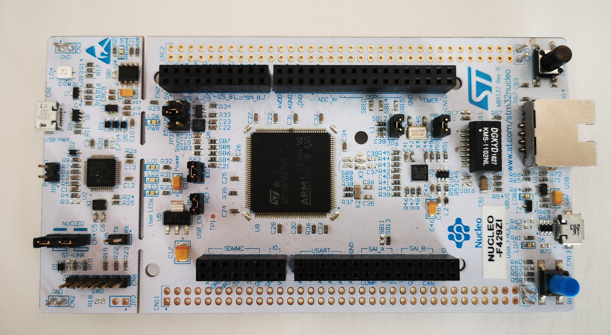
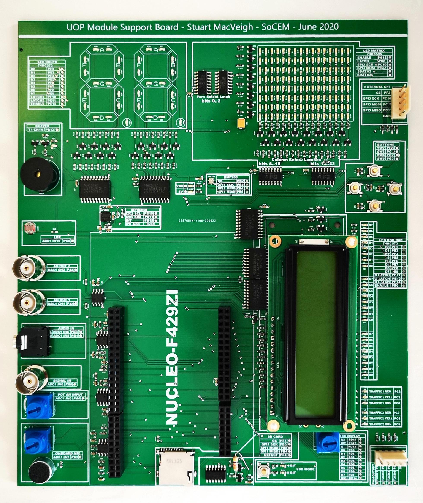
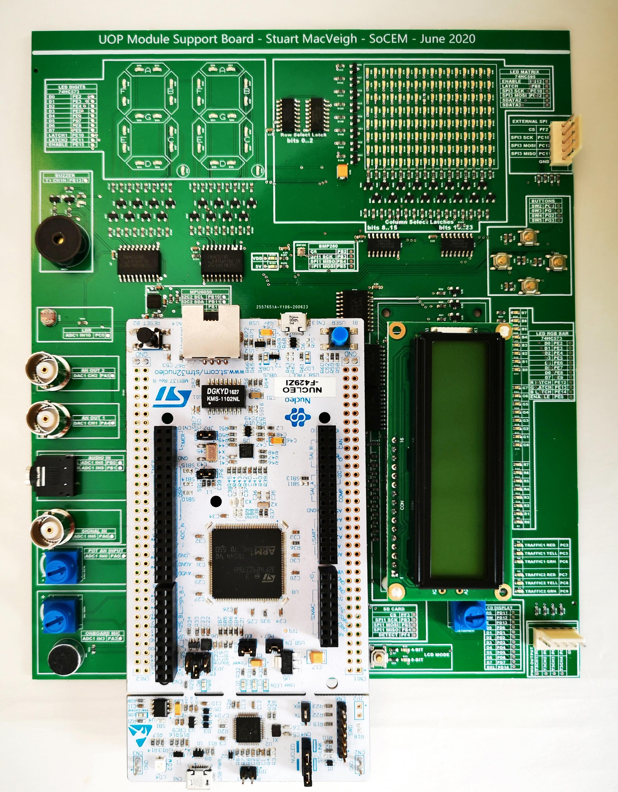
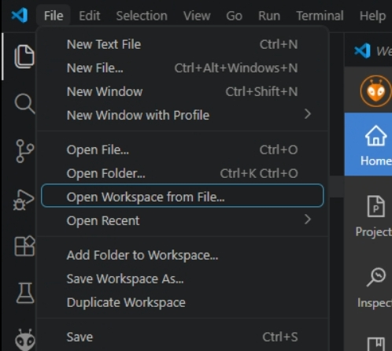
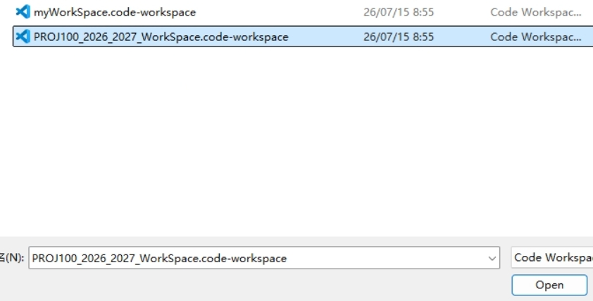
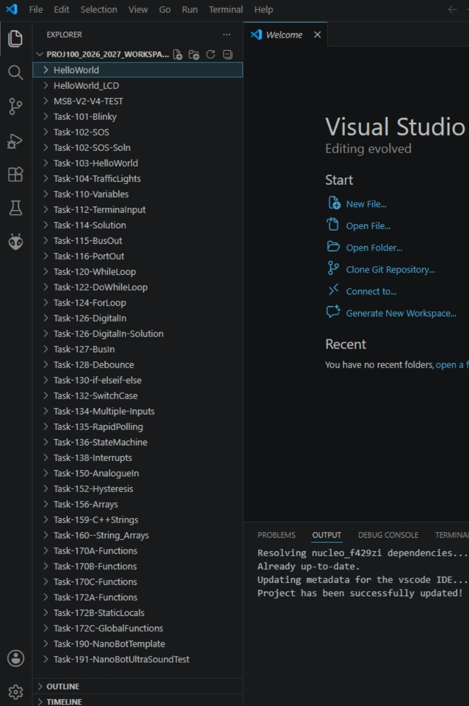
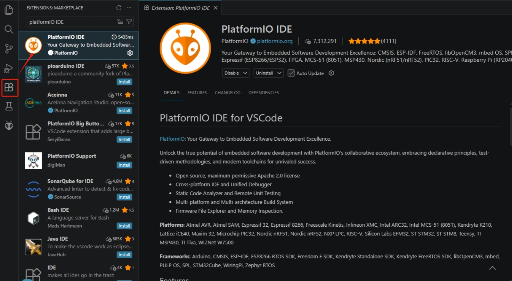
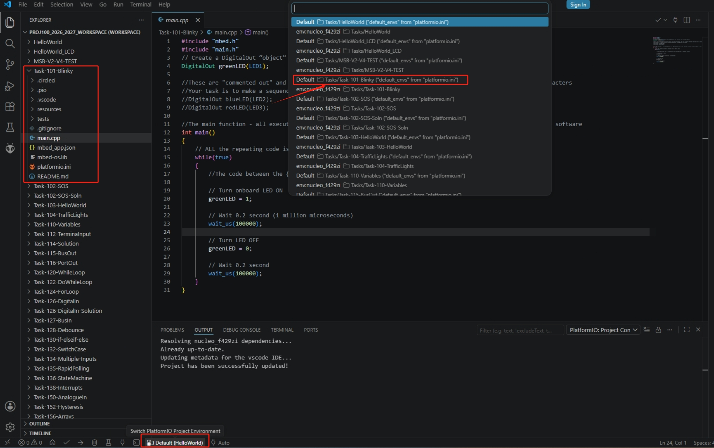

# Introduction (Week 1)
This topic is designed to get you exposed to writing embedded C/C++ and hopefully, give you a feel for the wider subject of embedded systems. This includes familiarization with the hardware, software tools and some basics of C/C++

In week 1, we will take some time to familiarize ourselves with the equipment and software. We don't want to be overly ambitious at this stage. It is better to invest some time learning to use the tools so we can focus on the coding aspects in subsequent weeks.  

## Tasks
The task this week is to simply set up your working environment so you are fully prepared for the remainder of the semester.

# Getting Started (Week 1)

In this section, we will look at how to set-up your own development environment so that you can work on your own computer. 

## Contents

# 1. [Familiarization with the Hardware](hardware.md)

[Table of Contents](README.md) 

---

# Familiarization with the Hardware
There are two pieces of hardware provided with this course:

* **Target Board** - A small low-powered "microcontroller", typically _embedded_ into a larger electronic system, that we will be programming to monitor the external environment and control devices.
 
* **Module Support Board** - This is a custom board containing sensors and output devices. You plug your Target Board into this in order to perform the various lab exercises.

 > There is another term you might encounter - the _host_ computer. This is referring to your PC. It is the machine you are writing code on. We write code on the _host_ and run it on the _target_

## Target Board
The target computer you will be programming is a small low-cost microcontroller based on the [Arm Cortex M4](https://www.arm.com/products/silicon-ip-cpu/cortex-m/cortex-m4)

* The microcontroller is a [STM32F429ZI/STM32F439ZI](https://www.st.com/en/microcontrollers-microprocessors/stm32f429zi.html) made by [ST Microelectronics](https://www.st.com)
* The board which hosts this device (and a few peripheral devices) is a [ST-Nucleo-F429ZI](https://os.mbed.com/platforms/ST-Nucleo-F429ZI/)

An image of the Nucleo board is shown below:

This board is connected to your host PC using a USB connector. **Do not connect this yet**

   > It might be worth noting that Arm Ltd. design the core of Cortex M [microcontroller](/glossary/microcontroller.md), but do not actually manufacture any silicon. The devices are made by other organisations who license the design from Arm.

You will use this board throughout your course. It is surprisingly capable for such a low-power device.

## University of Plymouth Module Support Board
The [Nucleo Target Board](#Target-Board) contains a few _peripherals_, including a push switch, three [Light Emitting Diodes (LEDs)](/glossary/led.md). 

> Peripherals refer to external devices connected (interfaced) to the microcontroller chip. These are either input devices (such as a switch, or a temperature sensor) or output devices (such as an LED or motor controller). Some devices, such as storage cards and memory chips, are both input and output devices.

The Module Support Board contains a **lot** more peripherals you can communicate with. This will help you gain valuable experience interfacing to electronic devices as you go through the course. 

Your Nucleo board connects directly onto this board.

Before you connect the USB cable, connect your Nucleo board to the MSB.

* Check the alignment using the image below and carefully connect your Nucleo to the module support board.

* Never force! The connectors need to be aligned carefully such that only gentle pressure is needed to get the Nucleo pins to seat into the sockets.

It is suggested that you do not remove the Nucleo from the module support board until instructed to do so.

### Schematics
You are encouraged to study the schematics of the module support board.

| Version | Link |
| - | - |
| 2 | [Schematics for v2](../Hardware/ModuleSupportBoard/msb_schematics_v2.pdf) |
| 4 | [Schematics for v4](../Hardware/ModuleSupportBoard/msb_schematics_v4.pdf) |
| |

> **TIP:** To open this link in a separate window, hold down CTRL and click. 
>
> Alternatively, the PDF file is located in the folder `Hardware\ModuleSupportBoard`

---

# 2. [Software Tools](software-tools.md)

## Visual Studio Code
This is a really useful piece of software used for editing software and configuration files. It can be obtained using the following address:

https://code.visualstudio.com/

This is one of the preferred methods for editing text files and programming source files outside of Mbed Studio. It can even be used as a complete development environment (with the right plugins).

# 3. [Testing the Hardware](hardware-testing.md)

# Testing the Hardware
Now you have all the key software tools, it's time to start testing the hardware.

## Connecting and Updating your Development Board
1. [Download the test image here](https://github.com/UniversityOfPlymouth-Electronics/Embedded-Systems/raw/master/Hardware/ModuleSupportBoard/board-test.bin)
1. Drag and Drop this onto your target board

[Click here to watch a video explaining how to do this](https://plymouth.cloud.panopto.eu/Panopto/Pages/Viewer.aspx?id=fca139f3-1931-4bb6-a22d-abfb00fa99a8)

If everything is working (as shown in the video) we can proceed to writing our first piece of software.

If the board is not working, check the following:

* The USB cable is connected to the correct end (oppose end to the network connector)
* The Power LED next to the USB connector is on and not flashing

If you cannot resolve these issues, please contact the module staff using Teams.

# 4. [Testing the Software](software-testing.md)

Download the lab tasks package.
https://github.com/UniversityOfPlymouth-Electronics/Embedded-Systems-PROJ100 

Save the package in local drive!

Now you should be able to see this:

---
Before stepping to the tasks, you should install PlatformIO IDE first. Some lab PCs have completed this but you still need to check.

## Task101 - Blinky!
When learning to program an embedded computer, the tradition is to run "Blinky", a program that simply flashes an LED on and off. This is very simple to do in VS code.

After completing the steps above. Return to the workspace which already includes all tasks. Open the main file of the Task 101 Blinky, you will find the C code script. To run the programme, we need to switch the default programme to Blinky as shown in the picture below. Click the Default button in the bottom of the page, then select the task 101 blinky in the list. 

---

Click *Build* "→" in the bottom of the page;
Then, click *Upload* "↑" to upload the code to you STM32 board.

---
# 5. [Troubleshooting](troubleshooting.md)
If you are unable to complete the above steps, please raise your hands up and ask for the technicain.